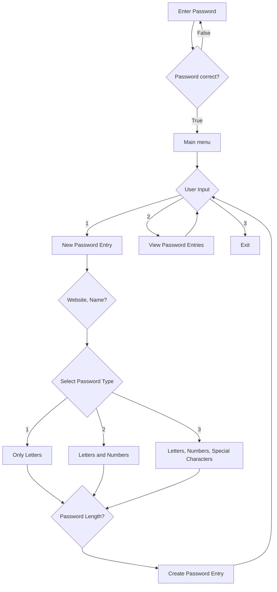

## SecurePassVault description

This program securely generates, stores, and manages passwords locally by employing the cryptography library’s Fernet symmetric encryption—protecting data with AES and HMAC—and strengthens security further using PBKDF2 key derivation with a salt.

## Functions

Password generator with varying complexity (letters only, letters + numbers, or letters + numbers + special characters).

CLI interface featuring login authentication, password generation, storage, and viewing with decryption on demand.

Handled secure storage and update of password entries in CSV format using the Pandas library, supporting adding new credentials and updating existing ones.

Ensured data privacy and security by encrypting all sensitive data locally and requiring a master password to access stored credentials.

