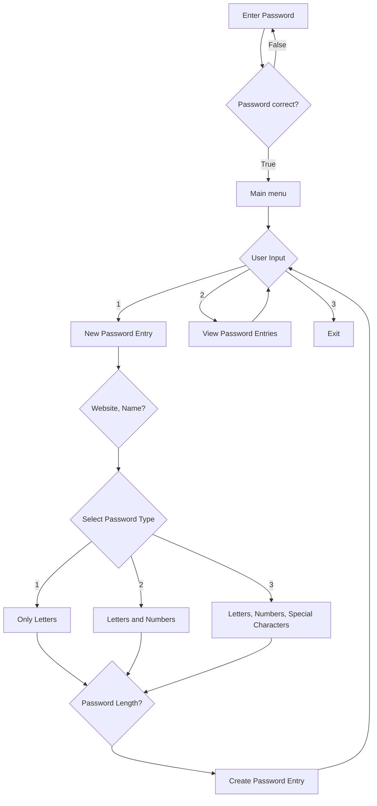

```mermaid
flowchart TD
    EnterMasterPW[Enter Password] --> PWValidation{Password correct?}
    PWValidation -->|False| EnterMasterPW
    PWValidation -->|True| MainMenu[Main menu]
    MainMenu -->UserInput{User Input}
    UserInput -->|1| CreatePWManagerEntry[New Password Entry]
    UserInput -->|2| ViewPasswordEntries[View Password Entries]
    UserInput -->|3| Exit[Exit]
    ViewPasswordEntries --> UserInput
    CreatePWManagerEntry --> PWEntry{Website, Name?}
    PWEntry --> PWEntryPasswordType{Select Password Type}
    PWEntryPasswordType -->|1| OnlyLetters[Only Letters]
    PWEntryPasswordType -->|2| LettersNumbers[Letters and Numbers]
    PWEntryPasswordType -->|3| LettersNumbersSpecial[Letters, Numbers, Special Characters]
    OnlyLetters --> PWEntryPasswordLength
    LettersNumbers --> PWEntryPasswordLength
    LettersNumbersSpecial --> PWEntryPasswordLength{Password Length?}
    PWEntryPasswordLength --> CreatePasswordEntry[Create Password Entry]
    CreatePasswordEntry --> UserInput

```
